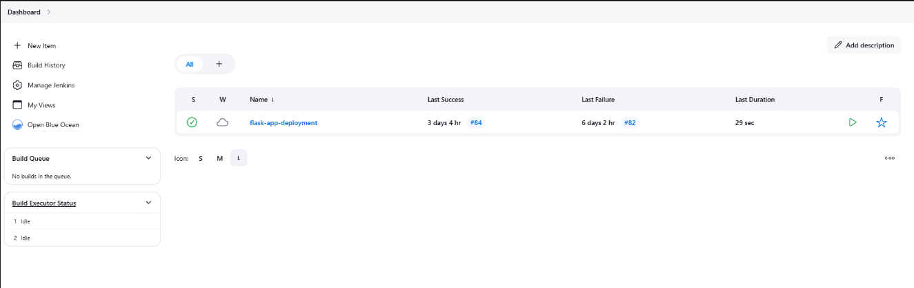

### Deployed Jenkins on AWS EC2 to automate a CI/CD pipeline for a Flask application. Triggered by Git commits, the pipeline builds a Docker image, runs automated tests, pushes the image to Docker Hub, sends build status via Gmail, and deploys the application on an EKS cluster.


## Prerequisites

- 1- AWS EC2 Instance for Jenkins - Includes Docker installed.
- 2- AWS EKS Cluster - Set up and ready to deploy applications.
- 3- Accounts - AWS , GitHub and Docker Hub for repository and image hosting.


### 1. Setup Jenkins on AWS EC2 Instance

- Install Docker on EC2 Instance:

```bash
sudo apt update
sudo apt install curl
sudo curl -fsSL https://download.docker.com/linux/ubuntu/gpg | sudo gpg --dearmor -o /etc/apt/trusted.gpg.d/docker.gpg
sudo add-apt-repository "deb [arch=$(dpkg --print-architecture)] https://download.docker.com/linux/ubuntu $(lsb_release -cs) stable"
sudo apt update
sudo apt -y install lsb-release gnupg apt-transport-https ca-certificates curl software-properties-common
sudo apt -y install docker-ce docker-ce-cli containerd.io docker-compose-plugin docker-registry
sudo usermod -aG docker $USER
newgrp docker

```
- Install Jenkins on EC2 Instance:

```bash

sudo wget -O /usr/share/keyrings/jenkins-keyring.asc https://pkg.jenkins.io/debian-stable/jenkins.io-2023.key

echo "deb [signed-by=/usr/share/keyrings/jenkins-keyring.asc]" https://pkg.jenkins.io/debian-stable binary/ | sudo tee /etc/apt/sources.list.d/jenkins.list > /dev/null

sudo apt update
sudo apt install fontconfig openjdk-17-jre -y
sudo apt install -y jenkins
sudo systemctl start jenkins
sudo systemctl status jenkins

Jenkins URL ====>>  http://Your-Machine-IP:8080

```
- Add Jenkins to Docker group

```bash
sudo usermod -aG docker jenkins
sudo systemctl restart jenkins
```

### 2. Navigate To Jenkins create pipeline and install suggested plugins

Make sure to install `Docker` `Docker Pipeline` `Kubernetes` `Kubernetes CLI` plugins

Credentials

- GitHub Credentials
- Docker Hub Credentials
- Gmail SMTP Configuration



Pipeline Status 


### 3. Install AWS CLI, kubectl, and eksctl

1- AWS CLI Installation:

```bash
curl "https://awscli.amazonaws.com/awscli-exe-linux-x86_64.zip" -o "awscliv2.zip"
sudo apt install unzip
unzip awscliv2.zip
sudo ./aws/install
```

2- kubectl Installation:

```bash
curl -o kubectl https://amazon-eks.s3.us-west-2.amazonaws.com/1.19.6/2021-01-05/bin/linux/amd64/kubectl
chmod +x ./kubectl
sudo mv ./kubectl /usr/local/bin
kubectl version --short --client
```

3- eksctl Installation:

```bash
curl --silent --location "https://github.com/weaveworks/eksctl/releases/latest/download/eksctl_$(uname -s)_amd64.tar.gz" | tar xz -C /tmp
sudo mv /tmp/eksctl /usr/local/bin
eksctl version
```
4- Configure AWS CLI

Configure AWS CLI with the credentials of the IAM user created earlier. 
Run: `aws configure`

- Access Key
- Secret Key
- Default region
- Output format 

### 4. Create EKS Cluster

`eksctl create cluster --name Flask-app-cluster --nodes-min=2` 

Wait 15 minutes for the cluster to be built.

### 5. Now your application is live.


